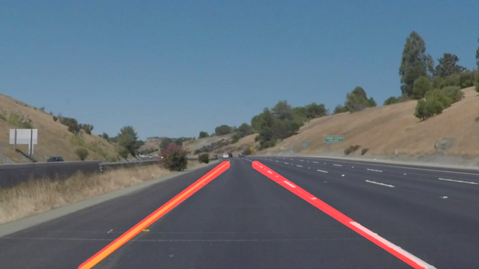

# **Finding Lane Lines on the Road**

When we drive, we use our eyes to decide where to go.  The lines on the road that show us where the lanes are act as our constant reference for where to steer the vehicle.  Naturally, one of the first things we would like to do in developing a self-driving car is to automatically detect lane lines using an algorithm.

In this project, I use Canny Edge Detection and Hough Transforms to detect lines in an image. Then I filter and process those lines to determine which belong to the left and right lane lines. Next I use the average slope, the highest point on the image, and the values from the previous frame to draw the lane lines on top of the original image.

The third video was an optional challenge video and you'll see my lane lines start to get a little wonky part way through. This is due to the shadows cast by the tree adding noise to the detected lines. As well as the Canny Edge Detection having a hard time picking up the yellow line on the whiter section of road. In an attempt to combat the noise, I tried to tighten the filters I was using to determine if a hough_line was part of a lane line. To combat the trouble finding a yellow line on a white road I tinkered with my canny edge thresholds and lowered them from 50 and 150 to 25 and 75.

#### **YouTube:** https://www.youtube.com/watch?v=DgkROMIthNI

## **Directory**
- **test_images**
  - Contains some simple test images to try and process
- **final_images**
  - Contains the test images with lane lines drawn on
- **solidWhiteRight.mp4, solidYellowLeft.mp4, challenge.mp4**
  - The original videos that I want to process, listed in order of increasing difficulty.
- **white.mp4, yellow.mp4, extra.mp4**
  - The processed versions of the videos.
- **stitched.mov**
  - The combination of the three processed videos
- **lane_lines.py**
  - Where the magic happens!
